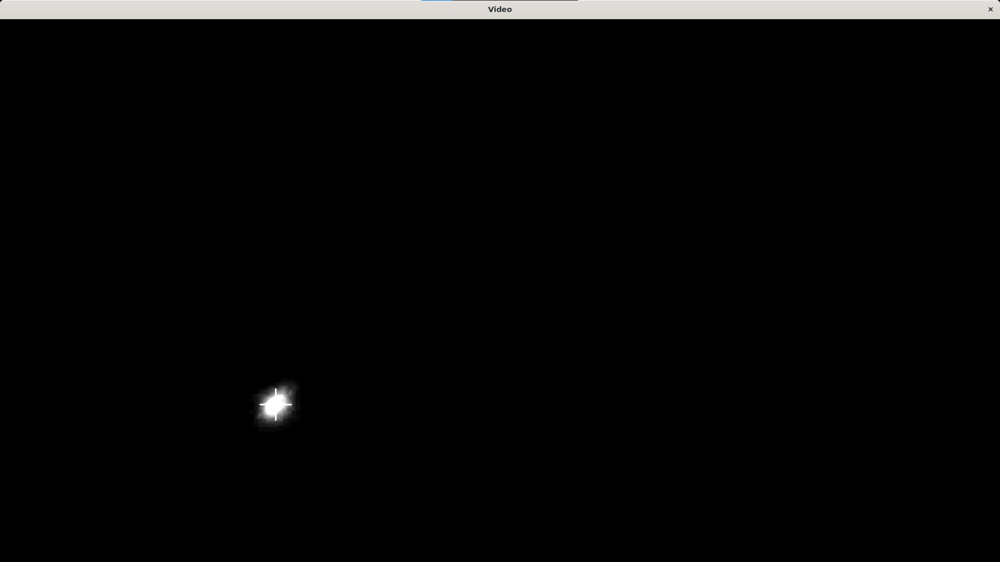

# Bright Spot Detector and Tracker

This project implements a bottom-up approach for detecting and tracking bright spots in video frames using OpenCV. The main goal is to accurately detect the centroid of a bright spot in the video frames.

## Features

- Detection and tracking of bright spots in video frames.
- Crosshair marking of the centroid of bright spot in each frame.
- Saving annotated video showing tracking as an MPEG-4.

## trackv2 Approach

1. **Base Image Calculation**: The project starts by computing a base image from the video frames. This base image serves as a reference free of moving objects (`compute_median_image.cpp`).
2. **Frame Processing**: Each frame is processed to detect bright spot by diffing with the base image and determining the thresholds by looking at the color channel saturation in GIMP and some hit and trial.
3. **Centroid Detection**: The centroid of the detected bright spot is calculated based on X and Y edges.
4. **Crosshair Drawing**: A crosshair is drawn at the centroid position on each frame.
5. **Video Output**: Annotated video showing the tracking of the bright spot is saved as an MPEG-4 file.

## trackv1 Approach

This approach utilizes a lagged reference frame technique to detect and track a bright spot in video frames. Here's a concise breakdown:

1. **Initialization**: Video capture is initialized, and matrices are set up to hold the current frame, the difference with the lagged reference frame, and the reference frame itself. Centroid variables are also initialized.
2. **Difference Calculation**: The absolute difference between frames is computed using a custom function (`absdiffCustom`). Centroid positions are identified where the difference exceeds a predefined threshold.
3. **Drawing Crosshair**: A crosshair is drawn at the centroid position on each frame. If no movement is detected, the previous centroid is used.
4. **Main Loop**: Frames are iterated through. Difference calculation, crosshair drawing, and frame output are performed. The lagged reference frame is updated every 30 frames.

The main disadvantage of this over v2 is when a bright spot doesn't move for over 30 frames we cannot detect it even if it is present.

All the following analysis is based on the `trackv2` approach.

## Results and Analysis

- For videos with dark backgrounds and minimal clutter, threshold values around 50 and 80 provided accurate bright spot detection.
- Videos with more noise and less bright spots required higher threshold values (100 and 120) for accurate detection.
- Threshold values were determined based on analysis of spot intensity and background characteristics using GIMP.

## Screenshots

- Detection in Dark room
  

- Detection in Dark room with Clutter
  

- Detection in Bright room with Clutter
  

- Detection with thresholds 50 vs 80 for a Dark Room without Clutter
  

- Detection with thresholds 50 vs 80 for a Dark Room with Clutter
  

## Dependencies

- C++ compiler
- OpenCV (if using OpenCV approach)
- GIMP or MATLAB (for analysis of spot characteristics)

## Usage

1. Clone the repository.
2. Compile the code.
3. Run the executable.
4. Provide the video file as input.
5. Analyze the annotated video for bright spot tracking.
